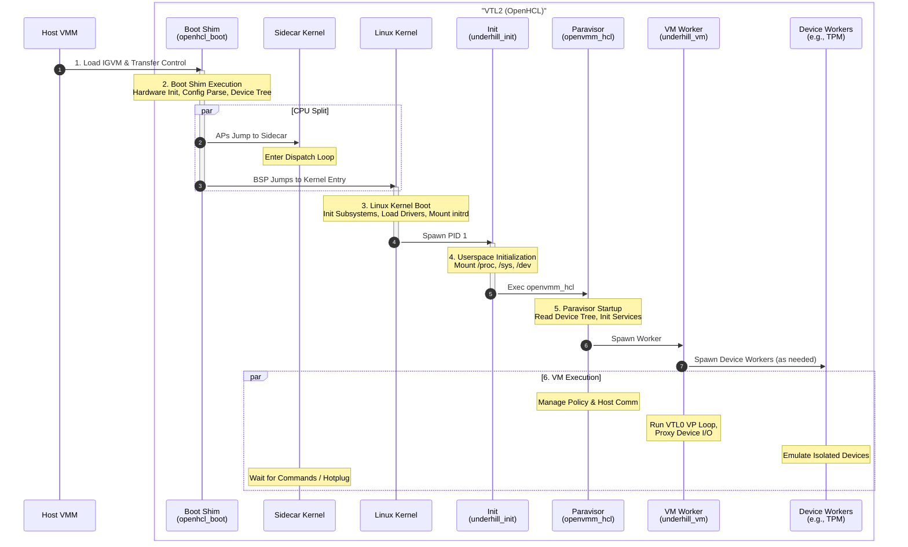

# OpenHCL Boot Flow

This document describes the sequence of events that occur when OpenHCL boots, from the initial loading of the IGVM image to the fully running paravisor environment.

## 1. IGVM Loading

The boot process begins when the host VMM loads the OpenHCL IGVM image into VTL2 memory.
The IGVM image contains the initial code and data required to start the paravisor, including the boot shim, kernel, and initial ramdisk.
The host places sections of the IGVM image at headers described by the IGVM format, which includes runtime dynamic data such as the device tree and other configuration values.

## 2. Boot Shim Execution (`openhcl_boot`)

The host transfers control to the entry point of the **Boot Shim**.

1. **Hardware Init:** The shim initializes the CPU state and memory management unit (MMU).
2. **Config Parsing:** It parses configuration from multiple sources:
    * **Contents of the IGVM image**, including:
      * **Measured parameters** Fixed parameters encoded into the measured section of the IGVM image, loaded by the host.
    * **Command Line:** It parses the kernel command line, which can be supplied via IGVM or the host device tree.
    * **Host Device Tree:** A device tree provided by the host containing topology and resource information.
3. **New Device Tree:** It constructs a Device Tree that describes the hardware topology (CPUs, memory) to the Linux kernel.
4. **Sidecar Setup (x86_64):** The shim determines which CPUs will run Linux (typically just the Bootstrap Processor (BSP)) and which will run the Sidecar (APs). It sets up control structures and directs Sidecar CPUs to the Sidecar entry point.
    * **Sidecar Entry:** "Sidecar CPUs" jump directly to the Sidecar kernel entry point instead of the Linux kernel.
    * **Dispatch Loop:** These CPUs enter a lightweight dispatch loop, waiting for commands.
5. **Kernel Handoff:** Finally, the BSP (and any Linux APs) jumps to the Linux kernel entry point, passing the Device Tree and command line arguments.

## 3. Linux Kernel Boot

The **Linux Kernel** takes over on the BSP and initializes the operating system environment. Sidecar CPUs remain in their dispatch loop until needed (e.g., hot-plugged for Linux tasks).

1. **Kernel Init:** The kernel initializes its subsystems (memory, scheduler, etc.).
2. **Driver Init:** It loads drivers for the paravisor hardware and standard devices.
3. **Root FS:** It mounts the initial ramdisk (initrd) as the root filesystem.
4. **User Space:** It spawns the first userspace process, `underhill_init` (PID 1).

## 4. Userspace Initialization (`underhill_init`)

`underhill_init` prepares the userspace environment.

1. **Filesystems:** It mounts essential pseudo-filesystems like `/proc`, `/sys`, and `/dev`.
2. **Environment:** It sets up environment variables and system limits.
3. **Exec:** It replaces itself with the main paravisor process, `/bin/openvmm_hcl`.

## 5. Paravisor Startup (`openvmm_hcl`)

The **Paravisor** process (`openvmm_hcl`) starts and initializes the virtualization services.

1. **Config Discovery:** It reads the system topology and configuration from `/proc/device-tree` and other kernel interfaces.
2. **Service Init:** It initializes internal services, such as the VTL0 management logic and host communication channels.
3. **Worker Spawn:** It spawns the **VM Worker** process (`underhill_vm`) to handle the high-performance VM partition loop.

## 6. VM Execution

At this point, the OpenHCL environment is fully established.

The `underhill_vm` process runs the VTL0 guest, handling exits and coordinating device emulation. During VM initialization, security-sensitive devices requiring isolation (such as the virtual TPM) are spawned as dedicated **device worker processes** that run the emulation logic in separate, sandboxed processes. The VM worker proxies I/O operations and guest memory accesses between the guest and these isolated device emulators.

Meanwhile, `openvmm_hcl` manages the overall policy and communicates with the host.
